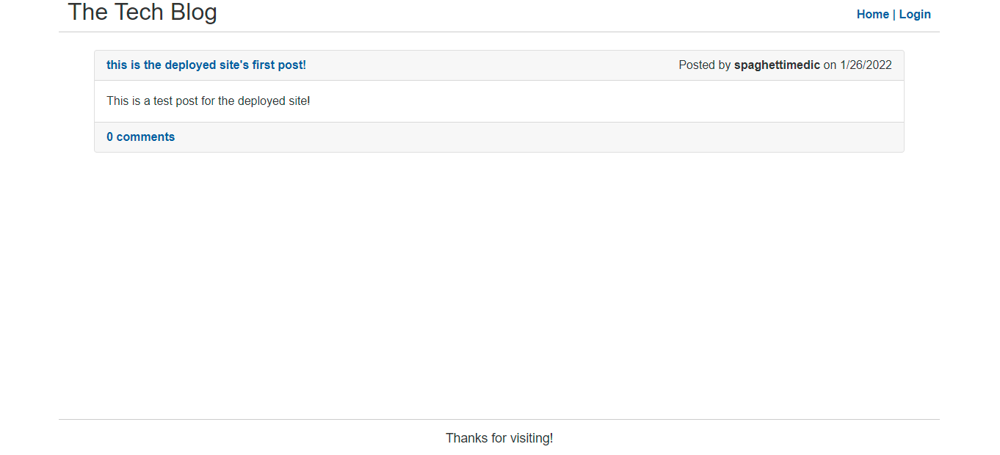
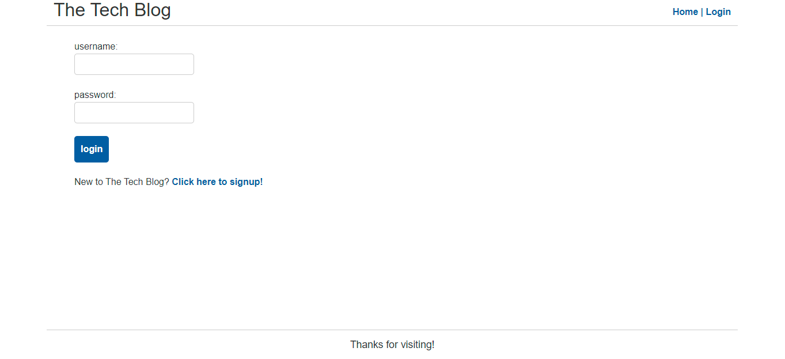
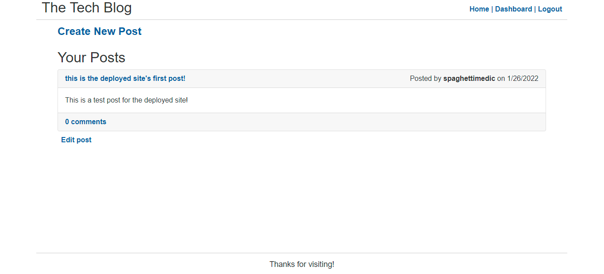
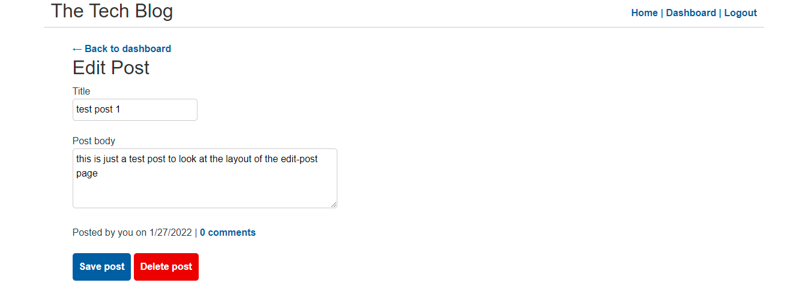
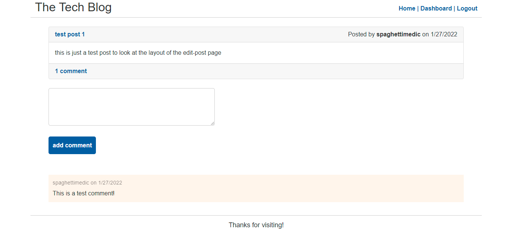
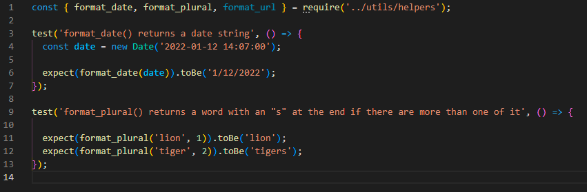
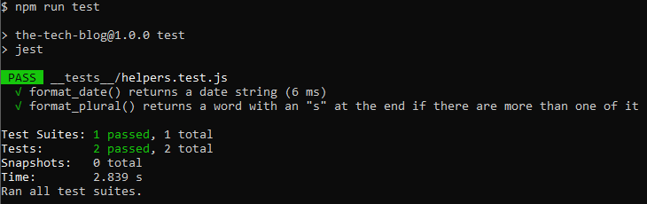

# The Tech Blog

## Description
The Tech Blog is a CMS-style blog site where users can make an account and publish articles & blog posts (text only currently), and comment on other users' posts. There is a simple dashboard page that shows all of your posts with the option to edit them, and a homepage that displays all posts by all users, sorted by the most recent posts from top to bottom.

## Table of Contents
* [Usage](#usage)
* [Contributing](#contributing)
* [Tests](#tests)
* [Questions](#questions)
* [Deployed Application](#deployed-application)

## Usage
Upon visiting the site for the first time, a user should click on the 'login' button in the top right corner to be re-routed to the login page. From there is a link to signup where you will be asked to enter a username and password. Once logged in, that username and passord will be saved in the databse for furture use.

On the dashboard page, users can click 'new post' to create a new post, or view/edit their previous posts.

You can also view or create comments on a post by clicking on the post title or '# comments' link on the post.

## Contributing
This is an open source project and as such, please follow the [Contributor Covenant](https://www.contributor-covenant.org/).

## Tests
The following tests were run using the Jest npm for custom Handlebars.js helpers.

## Questions
Check out my GitHub profile [here!](https://www.github.com/spaghettimedic) I can be reached directly at dsteiner247@gmail.com should you have any questions.

## Deployed Application
https://spaghettimedic-the-tech-blog.herokuapp.com/